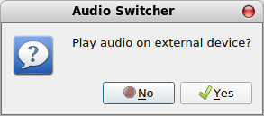

# AudioSwitcher
Version 1.0.0

Very simple audio port switcher UI

The AudioSwitcher uses pactl (pulseaudio) to determine, which devices and profiles are available and toggles the audio between the local device and an external device such as beamer or a monitor. 

Its intention is to enable a non specialist to change the audio output without using pavucontrol....



### Prerequisites
* python3
* python3-pyqt5
* pulseaudio

#### Prepare on Linux Mint (Tara) or Ubuntu 18.04 (bionic)
```
sudo apt-get install python3-pyqt5 
```
#### Prepare on Arch or Manjaro
```
sudo pacman -Syu python-pyqt5
```

### How to install
* Download the AudioSwitcher*.tar contained in the "build" folder 
* Unpack it and run the command  **sudo ./install.sh** in the unpacked folder.
* Install just copies a desktop file and some python scripts to /usr/local/sbin/AudioSwitcher

### Changes
 * 2019-12 Initial release